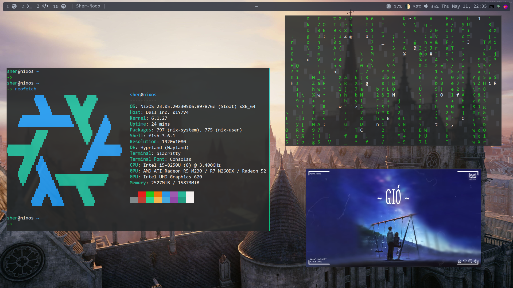

<div align="center">

# **Nixos - Hyprland**
</div>
Archived and moved to <a href="https://github.com/Sherly1001/dotfiles/tree/nix">dotfiles</a>.

# Screenshots

<br/>
<br/>

<br/>
<br/>

<br/>
<br/>

## Technology

- Operating System: Nixos
- Window Manager: Hyprland
- Compositor: Wayland
- Display Manager: None (Use tty for login)
- Terminal: Alacritty
- Editor: Neovim (neovide)
- Topbar: Waybar (dexperimental override)
- Launcher: Rofi

## Installation guide

```
git clone https://github.com/Sherly1001/flake ~/flake
cd ~/flake
cp /etc/nixos/hardware-configuration.nix hosts/
sudo nixos-rebuild switch --flake ~/flake/.#nixos
```
